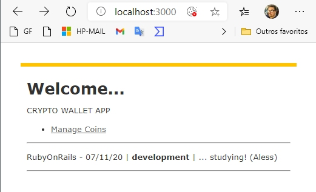
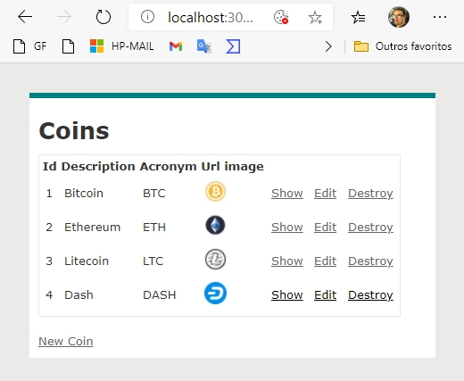
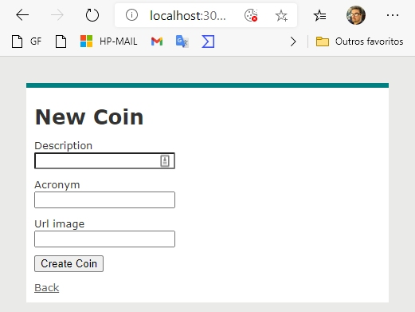

# CRYPTO_WALLET

This is a repository with a RubyOnRails project developed in the discipline of Fundamentals of RubyOnRails studied at UDEMY, in the 2020.

The course was focused on programming CRUD with RubyOnRails (A simple CRUD to manage crypto currenccy).

<table width:100%>
  <tr>
    <td></td>
    <td></td>
    <td></td>
    <td></td>
  </tr>
</table>

# This README would normally document whatever steps are necessary to get the application up and running.

Things I may want to cover:

* Ruby version

* System dependencies

* Configuration

* Database creation

* Database initialization

* How to run the test suite

* Services (job queues, cache servers, search engines, etc.)

* Deployment instructions

* ...

# To RUN

* bundle
* rails db:create
* rails db:migrate
* rails server
* http://localhost:3000/coins
